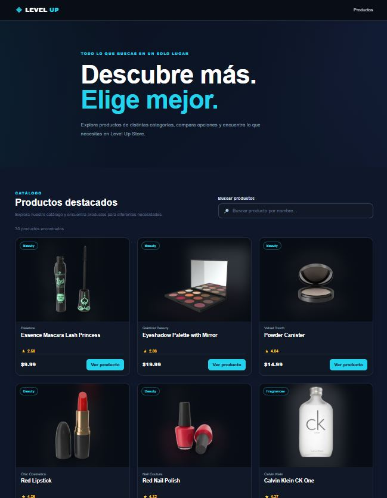
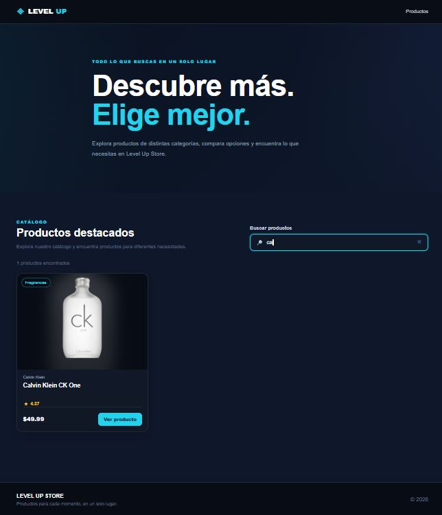
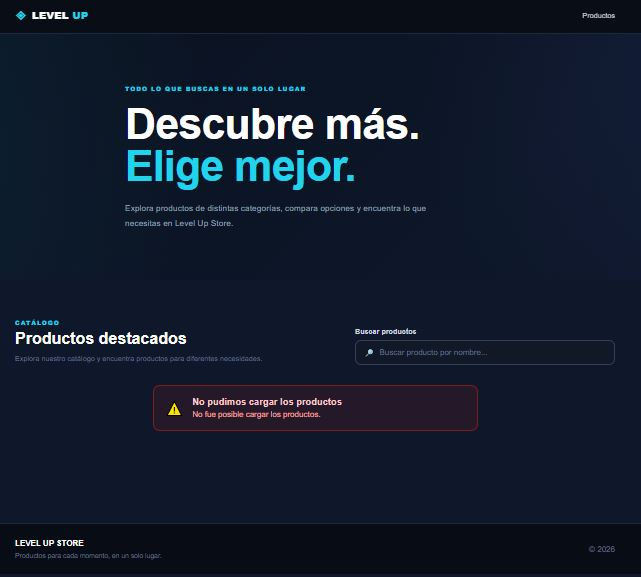

# Level Up Store

Level Up Store es un e-commerce desarrollado con React para la Evaluación 2 del Módulo 2 del Diplomado Full Stack.

La aplicación consume productos dinámicamente desde la API pública DummyJSON, permite buscar productos por nombre y maneja correctamente los estados de carga y error.

## Componentes creados

El proyecto utiliza los siguientes componentes:

- Header
- SearchBar
- ProductCard
- ProductList
- Loader
- ErrorMessage
- Footer

Cada componente se encuentra dentro de su propia carpeta y posee su propio archivo CSS.

## Funcionalidades

- Consumo de productos desde una API.
- Búsqueda de productos por nombre.
- Renderizado dinámico de productos.
- Estado de carga mediante Loader.
- Manejo de errores mediante ErrorMessage.
- ProductCard reutilizable mediante props.
- Diseño responsive para desktop y mobile.

## Consumo de API

La aplicación consume la API pública:

```text
https://dummyjson.com/products
```

El consumo se realiza utilizando `fetch` dentro de `useEffect`.

La aplicación maneja los siguientes estados:

- `products`: almacena los productos obtenidos desde la API.
- `loading`: controla el estado de carga.
- `error`: almacena los errores producidos durante la solicitud.

## Tecnologías utilizadas

- React
- JavaScript
- HTML5
- CSS3
- Vite
- Git
- GitHub
- DummyJSON

## Cómo ejecutar el proyecto

1. Clonar el repositorio:

```bash
git clone https://github.com/OGRodrigo/M2_Evaluacion2.git
```

2. Entrar a la carpeta del proyecto:

```bash
cd M2_Evaluacion2
```

3. Instalar las dependencias:

```bash
npm install
```

4. Ejecutar el proyecto:

```bash
npm run dev
```

5. Abrir en el navegador la dirección indicada por Vite.

## Capturas de pantalla

### Vista general



### Búsqueda funcionando



### Manejo de error

